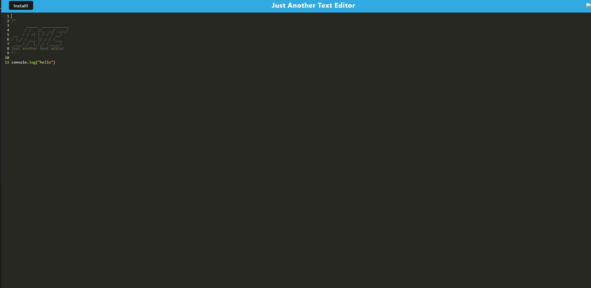

# PWA-Text-Editor-M19
Offline single-page text editor that runs in the browser featuring a number of data persistence techniques that serve as redundancy in case one of the options is not supported by the browser.

## Description
This project is Robert Gosselin's nineteenth bootcamp challenge. This project was created to showcase his skills and aptitude using only text based instructions. This application was hand-written utilizing credited resources [Credits](#credits). The goal of this challenge was to develop and engineer a functioning online/offline text editor referred to as JATE or Just Another Text Editor. Everything included was apart of an ongoing bootcamp to develop and hone Full Stack Web Development skills.

## Screenshot
Feel free to view below screenshot (ctrl + click).

## Live Web App
https://pwa-text-editor-m19.onrender.com

## Repository
https://github.com/bcgosselin/PWA-Text-Editor-M19

## Table of Contents
- [Installation](#installation)
- [Usage](#usage)
- [License](#license)
- [Credits](#credits)
- [Questions](#questions)

## Installation

requires Node package: https://nodejs.org/en/download

requires idb package: https://www.npmjs.com/package/idb

requires babel package: https://babeljs.io/

All packages can be installed by running npm i in the project root directory.

## Usage

To install application for offline useage click the install button on the right hand side of the URL window in your browser.

## License

## Credits

Starter Code:
    https://github.com/coding-boot-camp/cautious-meme

concurrently set up:
    https://www.npmjs.com/package/concurrently#usage

cache:
    https://developer.chrome.com/docs/workbox/modules/workbox-strategies

install.js
    https://developer.mozilla.org/en-US/docs/Web/API/BeforeInstallPromptEvent

help from tutor on slack

help from instructor during office hours

help from classmate

## Questions
For questions about the project, please contact [bcgosselin](https://github.com/bcgosselin) at bcgosselin@gmail.com.
